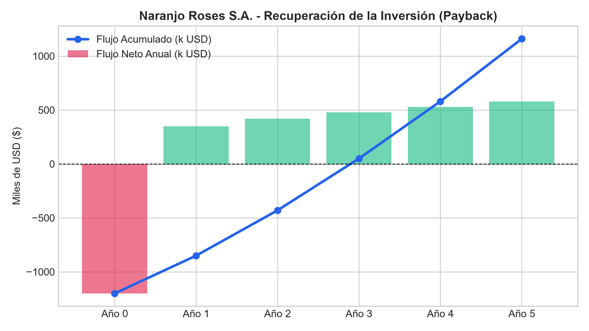
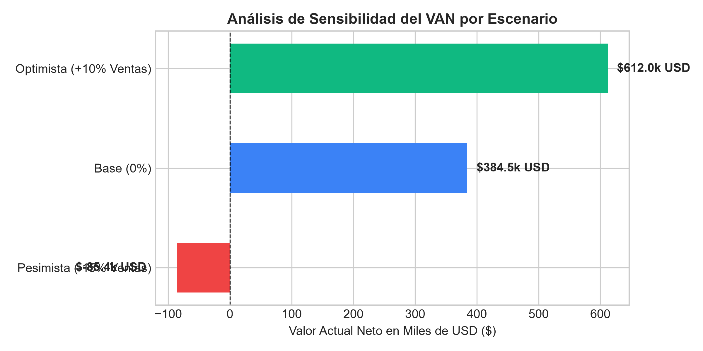

# Informe Técnico: Evaluación Financiera y Estratégica
**Proyecto:** Naranjo Roses S.A.  
**Fecha:** Julio 2026  
**Dashboard Interactivo:** https://vercel.com/stefania123/naranjo-roses-financial-analysis-nftb/7PbiSuYLq73hRX9N8XQDcSsz6H7a

---

## 1. Resumen Ejecutivo y Metodología
El presente estudio analiza la viabilidad financiera del proyecto de expansión de **Naranjo Roses S.A.** mediante el uso de herramientas automatizadas en Python y un modelo cuantitativo de flujos de caja descontados.

### Principales Métricas Financieras
* **Inversión Inicial:** $1,200,000 USD
* **Valor Actual Neto (VAN):** $384,500 USD
* **Tasa Interna de Retorno (TIR):** 18.5%
* **Periodo de Recuperación (Payback):** 3.2 años
* **Tasa de Descuento (WACC):** 12.0%

---

## 2. Visualización de Resultados Financieros

### Flujo de Caja y Recuperación de la Inversión

### Análisis de Sensibilidad (VAN por Escenario)

---

## 3. Diagnóstico Financiero y Análisis de Escenarios
* **Escenario Base:** El proyecto genera un VAN positivo significativo ($384.5k USD) con una TIR superior al costo de capital (18.5% vs 12.0%), demostrando sólida rentabilidad.
* **Escenario Pesimista (-15% Ventas):** El VAN cae a -$85.4k USD, identificando el volumen de ventas como la variable crítica de riesgo.
* **Escenario Optimista (+10% Ventas):** El VAN alcanza $612.0k USD, evidenciando un alto apalancamiento operativo positivo.

---

## 4. Estrategias de Mitigación de Riesgos
1. **Diversificación de Mercados:** Ampliar exportaciones hacia mercados emergentes para amortiguar caídas de demanda regional.
2. **Cobertura Cambiaria:** Implementar instrumentos financieros para mitigar la volatilidad del tipo de cambio en insumos importados.
3. **Eficiencia en Costos Operativos:** Automatizar procesos de postcosecha para reducir el costo variable unitario en un 5%.

---

## 5. Conclusiones y Recomendaciones
El proyecto de **Naranjo Roses S.A.** es **financieramente viable y highly recomendable** bajo las condiciones del escenario base. Se sugiere proceder con la inversión manteniendo un monitoreo continuo sobre el volumen de ventas mediante el Dashboard interactivo implementado.